# 🏗️ Tetriz System Architecture

## Overview

Tetriz is built using a modern, scalable architecture designed for mobile-first gaming experiences with retro aesthetics and high performance.

## 📊 Architecture Diagrams

### High-Level System Architecture

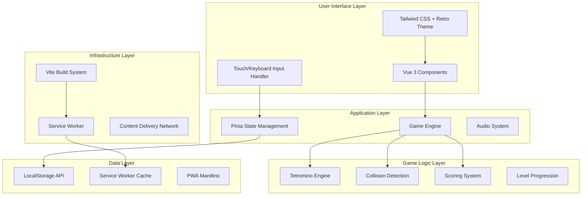

### Component Architecture

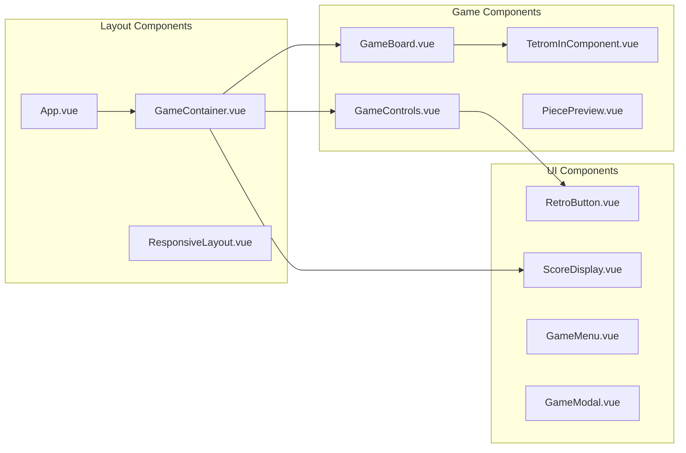

### Data Flow Architecture

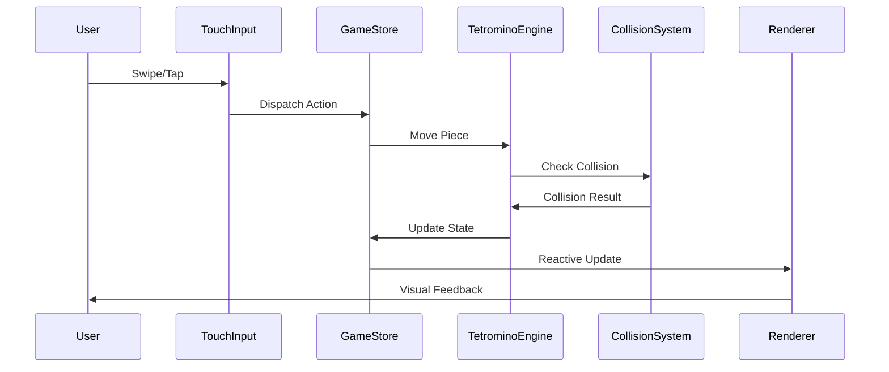

### Mobile Responsive Strategy

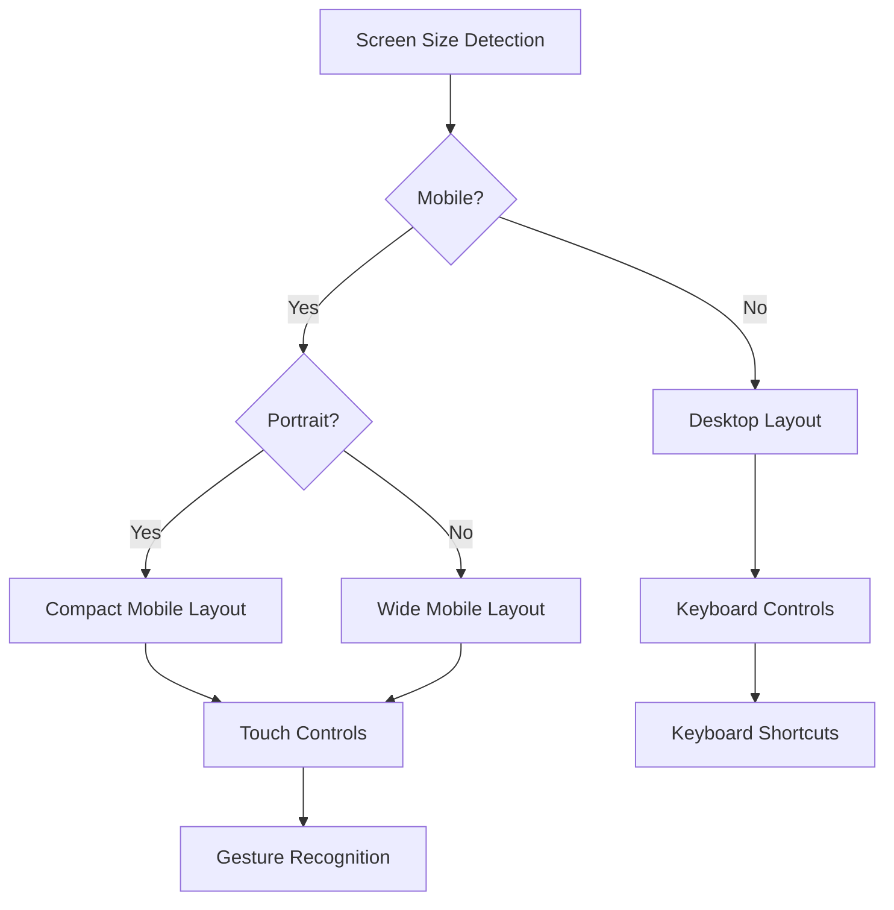

## 🎮 Game Engine Architecture

### Game Loop Design

```typescript
// Simplified game loop architecture
class GameEngine {
  private lastTime = 0;
  private accumulator = 0;
  private readonly timeStep = 1000 / 60; // 60 FPS
  
  gameLoop(currentTime: number) {
    const deltaTime = currentTime - this.lastTime;
    this.lastTime = currentTime;
    this.accumulator += deltaTime;
    
    // Fixed time step for consistent physics
    while (this.accumulator >= this.timeStep) {
      this.update(this.timeStep);
      this.accumulator -= this.timeStep;
    }
    
    // Render with interpolation
    this.render(this.accumulator / this.timeStep);
    
    requestAnimationFrame((time) => this.gameLoop(time));
  }
}
```

### State Management Architecture

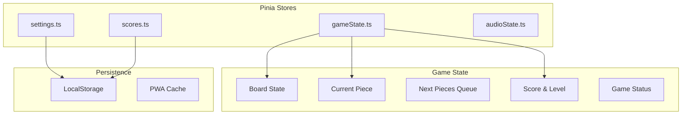

## 📱 Mobile-First Design Principles

### Responsive Breakpoints

```scss
// Tailwind custom breakpoints for Tetris
module.exports = {
  theme: {
    screens: {
      'xs': '320px',    // Small phones
      'sm': '640px',    // Large phones
      'md': '768px',    // Tablets
      'lg': '1024px',   // Small laptops
      'xl': '1280px',   // Desktop
      '2xl': '1536px'   // Large desktop
    }
  }
}
```

### Touch Control Zones

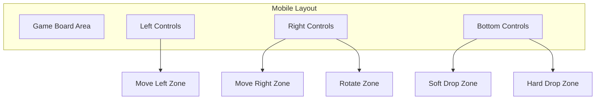

## 🎨 Visual Architecture

### Retro Theme System

```typescript
// Retro color palette configuration
export const retroTheme = {
  colors: {
    // Neon colors for pieces
    neonBlue: '#00FFFF',
    neonGreen: '#00FF00', 
    neonPink: '#FF00FF',
    neonOrange: '#FF8000',
    neonYellow: '#FFFF00',
    neonRed: '#FF0040',
    neonPurple: '#8000FF',
    
    // Background and UI
    darkBg: '#0A0A0A',
    gridLines: '#333333',
    glowEffect: 'rgba(0, 255, 255, 0.5)',
    
    // Retro UI elements
    scanLines: 'rgba(0, 255, 0, 0.1)',
    crtGlow: 'rgba(0, 255, 255, 0.2)'
  }
};
```

### Animation System

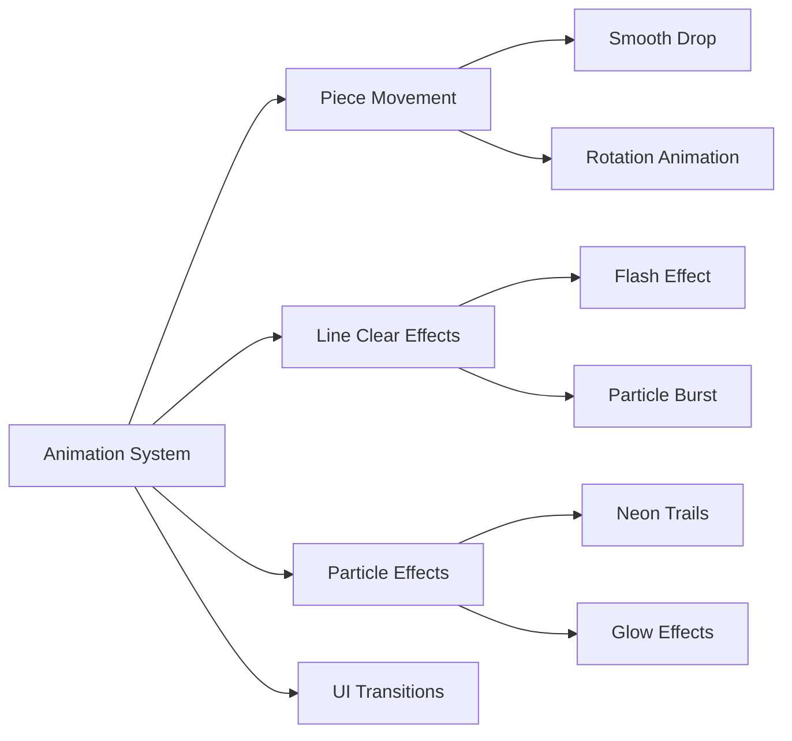

## 🔊 Audio Architecture

### Audio System Design

```typescript
interface AudioSystem {
  // Background music
  backgroundMusic: {
    menu: AudioBuffer;
    gameplay: AudioBuffer;
    gameOver: AudioBuffer;
  };
  
  // Sound effects
  soundEffects: {
    pieceDrop: AudioBuffer;
    pieceRotate: AudioBuffer;
    lineClear: AudioBuffer;
    levelUp: AudioBuffer;
    gameOver: AudioBuffer;
  };
  
  // Audio controls
  masterVolume: number;
  musicVolume: number;
  sfxVolume: number;
  muted: boolean;
}
```

## ⚡ Performance Architecture

### Optimization Strategies

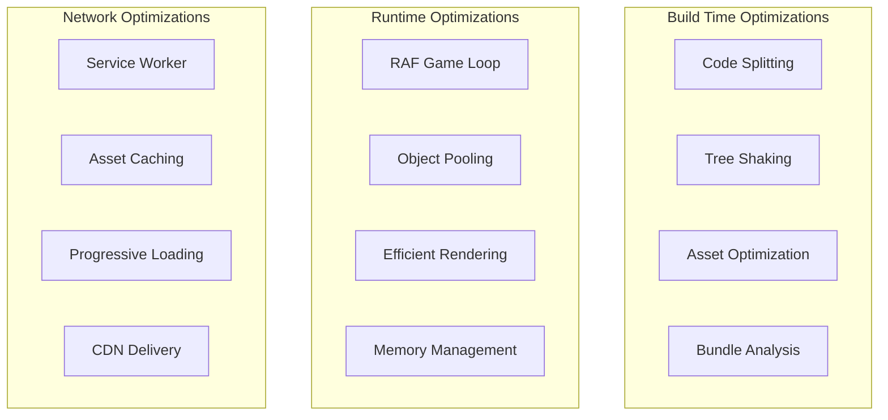

### Performance Monitoring

```typescript
// Performance metrics tracking
interface PerformanceMetrics {
  fps: number;
  frameTime: number;
  memoryUsage: number;
  bundleSize: number;
  loadTime: number;
  interactionLatency: number;
}
```

## 🧪 Testing Architecture

### Testing Strategy

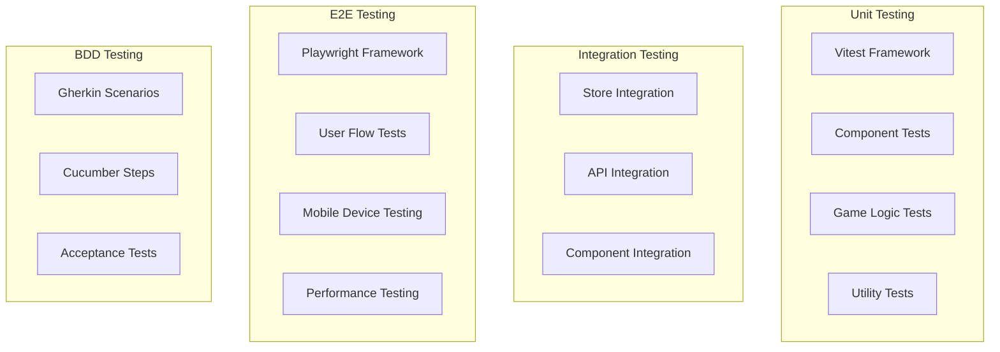

## 🚀 Deployment Architecture

### CI/CD Pipeline

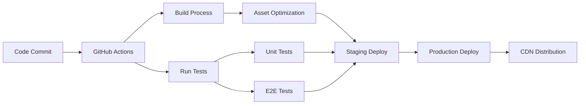

### Infrastructure Components

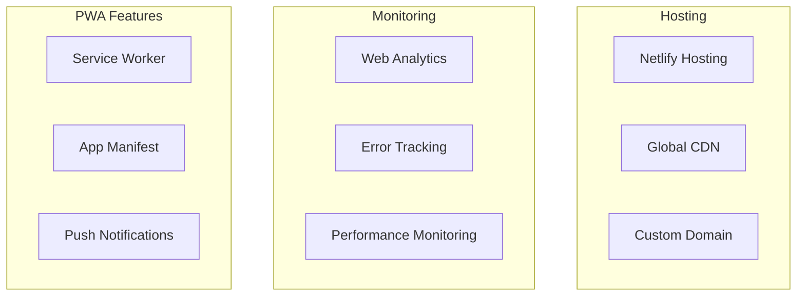

## 📊 Data Architecture

### Local Storage Strategy

```typescript
interface GameData {
  // User preferences
  settings: {
    volume: number;
    controls: ControlScheme;
    theme: ThemePreference;
  };
  
  // Game statistics
  stats: {
    highScores: HighScore[];
    totalGamesPlayed: number;
    totalLinesCleared: number;
    bestLevel: number;
  };
  
  // Achievement system
  achievements: Achievement[];
}
```

### PWA Storage Strategy

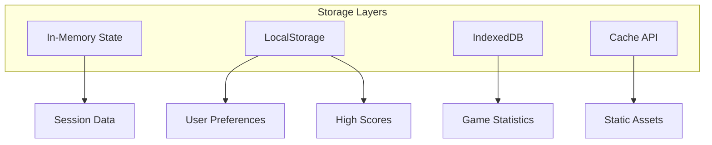

---

## 🔧 Development Guidelines

### Code Organization Principles

1. **Separation of Concerns**: Clear boundaries between UI, business logic, and data layers
2. **Component Composition**: Small, reusable components with single responsibilities
3. **Type Safety**: Comprehensive TypeScript interfaces and strict type checking
4. **Performance First**: Optimized for 60fps gameplay and minimal bundle size
5. **Mobile First**: All features designed for touch interaction first

### Scalability Considerations

- Modular architecture supporting additional game modes
- Plugin system for custom themes and effects
- Extensible scoring and achievement systems
- Multi-language support infrastructure
- Analytics and telemetry integration points

---

*Architecture designed for modern web gaming with retro aesthetics*  
*Built with Vue 3, TypeScript, and cutting-edge web technologies*