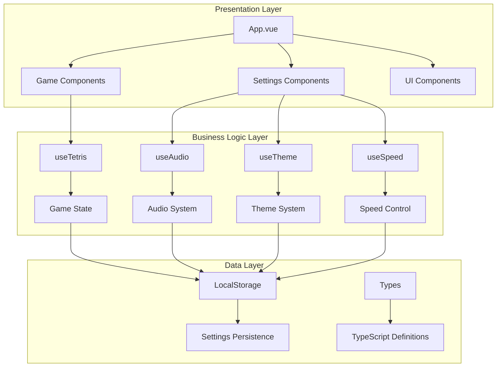

# 🏗️ Tetrys Architecture Overview

This document provides a comprehensive overview of the Tetrys architecture, design patterns, and system organization.

## 🎯 Architecture Philosophy

Tetrys follows modern web development best practices with a focus on:

- **Separation of Concerns**: Clear boundaries between UI, state, and business logic
- **Reactive Design**: Vue 3 Composition API for reactive state management
- **Type Safety**: TypeScript throughout the entire codebase
- **Performance**: Optimized rendering and efficient state updates
- **Maintainability**: Clean, documented, and testable code
- **Accessibility**: WCAG 2.1 AA compliant design

## 🏛️ System Architecture



## 📊 Layer Breakdown

### 1. Presentation Layer (Vue Components)

**Purpose**: Handle user interface, user interactions, and visual presentation

**Components**:
- `App.vue` - Root application component and layout orchestration
- `GameBoard.vue` - Renders the game grid and falling pieces
- `GameControls.vue` - Action buttons and touch/keyboard input handling
- `ScoreBoard.vue` - Displays score, level, and statistics
- `NextPiece.vue` - Shows preview of the next tetromino
- `ThemeSelector.vue` - Theme switching interface
- `AudioControls.vue` - Audio settings and volume controls
- `SpeedControl.vue` - Game speed adjustment interface

### 2. Business Logic Layer (Composables)

**Purpose**: Manage application state, business rules, and system coordination

**Composables**:
- `useTetris.ts` - Core game logic, piece movement, collision detection
- `useAudio.ts` - Audio system management, Web Audio API coordination
- `useTheme.ts` - Theme management and CSS custom properties
- `useSpeed.ts` - Game speed control and persistence

### 3. Data Layer (Types & Persistence)

**Purpose**: Define data structures and handle data persistence

**Components**:
- `types/tetris.ts` - Game state, piece definitions, and game mechanics types
- `types/theme.ts` - Theme configuration and color scheme definitions
- `localStorage` - Browser storage for settings persistence

## 🔄 Event-Driven Architecture

Tetrys implements a sophisticated event-driven architecture that decouples components and composables through a centralized event bus system, enabling reactive communication, testability, and maintainability.

**Quick Overview**:
- **Event Bus**: Singleton mitt instance (200 bytes) with TypeScript type safety
- **Publishers**: useTetris emits 9 event types (game:started, lines:cleared, score:updated, etc.)
- **Subscribers**: useAudio, useAchievements, and UI components react to events
- **Benefits**: Zero coupling between game logic and side effects, easy feature additions, simplified testing
- **Development**: Automatic event logging in dev mode for debugging

### Event-Driven Design Principles

**Core Philosophy**:
- **Decoupling**: Components don't need direct references to each other
- **Single Responsibility**: Emitters focus on business logic, subscribers focus on reactions
- **Testability**: Events can be intercepted and verified in isolation
- **Scalability**: New features subscribe to existing events without modifying emitters
- **Reactivity**: Automatic UI updates through Vue's reactive system

**Benefits**:
- Clean separation between game logic (useTetris) and side effects (useAudio, useAchievements)
- Components can subscribe to events without tight coupling to game state
- Easy to add new features (e.g., achievements) without modifying existing code
- Simplified testing through event mocking and verification
- Built-in development logging for debugging event flow

### Event Bus Implementation

**Technology Choice**: [mitt](https://github.com/developit/mitt) - A tiny (200 bytes) functional event emitter
- Type-safe through TypeScript generics
- Zero dependencies, tree-shakeable
- Fast performance with minimal overhead
- Simple API: `on()`, `off()`, `emit()`

**Singleton Pattern**:
```typescript
// src/composables/useGameBus.ts
import mitt from 'mitt'
import type { GameBusEvents } from '@/types/events'

// Create singleton event bus instance
const gameBus = mitt<GameBusEvents>()

// Development mode: log all events for debugging
if (import.meta.env.DEV) {
  gameBus.on('*', (type, event) => {
    console.log(`[GameBus] ${String(type)}`, event)
  })
}

export function useGameBus() {
  return gameBus
}
```

**Type Safety**:
```typescript
// src/types/events.ts
export interface GameEvents {
  'game:started': { timestamp: number }
  'lines:cleared': { count: number; isTetris: boolean; newTotal: number }
  'score:updated': { score: number; delta: number; level: number }
  'combo:updated': { combo: number; isReset: boolean }
  'achievement:unlocked': { id: AchievementId; rarity: string; timestamp: number }
  // ... more typed events
}

export type GameBusEvents = GameEvents & { [key: string]: unknown }
```

### System Architecture Diagram

```
┌─────────────────────────────────────────────────────────────────────┐
│                        EVENT-DRIVEN SYSTEM                           │
└─────────────────────────────────────────────────────────────────────┘

┌──────────────┐           ┌──────────────┐           ┌──────────────┐
│              │           │              │           │              │
│  useTetris   │──emit───→ │  Event Bus   │──on─────→ │  useAudio    │
│  (Emitter)   │           │  (Singleton) │           │ (Subscriber) │
│              │           │              │           │              │
└──────────────┘           └──────┬───────┘           └──────────────┘
                                  │
                                  │
                         ┌────────┼────────┐
                         │                 │
                    ┌────▼─────┐     ┌────▼────────┐
                    │          │     │             │
                    │  useAch  │     │ Components  │
                    │ ievements│     │    (UI)     │
                    │          │     │             │
                    └──────────┘     └─────────────┘

EVENT FLOW EXAMPLE:
==================
User Action → movePiece() → clearLines() → emit('lines:cleared')
                                                    │
                    ┌───────────────────────────────┼─────────────┐
                    ▼                               ▼             ▼
              playSound('line')            checkAchievements()  UI Update
```

### Event Flow Architecture

**Publisher-Subscriber Pattern**:

```typescript
// EMITTER: useTetris (Game Logic)
const clearLines = () => {
  const linesCleared = detectFullLines()

  // Emit event with structured payload
  bus.emit('lines:cleared', {
    count: linesCleared,
    isTetris: linesCleared === 4,
    newTotal: gameState.lines,
    newLevel: gameState.level
  })

  // Emitter doesn't know or care who's listening
}

// SUBSCRIBER: useAudio (Sound Effects)
bus.on('lines:cleared', (data) => {
  playSound(data.isTetris ? 'tetris' : 'line')
})

// SUBSCRIBER: useAchievements (Progress Tracking)
bus.on('lines:cleared', (data) => {
  eventDrivenStats.lines += data.count
  if (data.isTetris) eventDrivenStats.tetrisCount++
  checkAchievements()
})

// SUBSCRIBER: UI Component (Visual Feedback)
bus.on('lines:cleared', (data) => {
  showLineClearAnimation(data.count)
})
```

### Data Flow Diagram

```
┌─────────────────────────────────────────────────────────────────┐
│                     USER INTERACTION FLOW                        │
└─────────────────────────────────────────────────────────────────┘

Input (Keyboard/Touch/Button)
         │
         ▼
┌────────────────┐
│ GameControls   │  User presses left arrow
│   Component    │
└────────┬───────┘
         │ call
         ▼
┌────────────────┐
│  useTetris()   │  movePiece(-1, 0)
│  Composable    │
└────────┬───────┘
         │
         ▼
   Game Logic Updates
   (collision detection,
    position update,
    state mutation)
         │
         ▼
┌────────────────┐
│ emit() Events  │  'piece:moved', 'score:updated', etc.
└────────┬───────┘
         │
         ├───────────┬──────────────┬─────────────┐
         ▼           ▼              ▼             ▼
   ┌─────────┐ ┌──────────┐ ┌───────────┐ ┌──────────┐
   │ useAudio│ │useAchieve│ │Components │ │  Other   │
   │         │ │  ments   │ │   (UI)    │ │Subscribers│
   └────┬────┘ └────┬─────┘ └─────┬─────┘ └────┬─────┘
        │           │             │            │
        ▼           ▼             ▼            ▼
   Play Sound   Check Progress  Re-render   Custom Logic
                 Unlock Badge   Animation
         │           │             │            │
         └───────────┴─────────────┴────────────┘
                         │
                         ▼
                 User perceives result
              (sound, visuals, feedback)
```

### Composable Event Relationships

```
┌─────────────────────────────────────────────────────────────┐
│                   EVENT EMITTERS (Publishers)                │
└─────────────────────────────────────────────────────────────┘

useTetris.ts
  ├─ emit('game:started') ──────→ Reset tracking, start music
  ├─ emit('game:paused') ───────→ Pause music, show pause UI
  ├─ emit('game:over') ─────────→ Stop music, play game over sound
  ├─ emit('lines:cleared') ─────→ Play sound, check achievements
  ├─ emit('score:updated') ─────→ Check score achievements
  ├─ emit('level:up') ──────────→ Play level up sound
  ├─ emit('combo:updated') ─────→ Check combo achievements
  ├─ emit('piece:placed') ──────→ Track piece placement
  └─ emit('time:tick') ─────────→ Track play time

useAchievements.ts
  └─ emit('achievement:unlocked') → Play sound, show notification

┌─────────────────────────────────────────────────────────────┐
│                  EVENT SUBSCRIBERS (Listeners)               │
└─────────────────────────────────────────────────────────────┘

useAudio.ts
  ├─ on('game:started') ────────→ startMusic()
  ├─ on('game:paused') ─────────→ pauseMusic()
  ├─ on('game:over') ───────────→ stopMusic(), playSound('gameover')
  ├─ on('lines:cleared') ───────→ playSound('line' | 'tetris')
  ├─ on('level:up') ────────────→ playSound('levelup')
  └─ on('achievement:unlocked') → playSound('achievement')

useAchievements.ts
  ├─ on('game:started') ────────→ Reset stats tracking
  ├─ on('lines:cleared') ───────→ Update lines, tetris count
  ├─ on('score:updated') ───────→ Update score
  ├─ on('combo:updated') ───────→ Update combo
  └─ on('time:tick') ───────────→ Update time played

UI Components (GameBoard, ScoreBoard, etc.)
  ├─ on('lines:cleared') ───────→ Show clear animation
  ├─ on('level:up') ────────────→ Show level up visual
  ├─ on('combo:updated') ───────→ Display combo counter
  └─ on('achievement:unlocked') → Show notification toast
```

### Reactive State Management

```typescript
// Composable Pattern with Event Integration
export function useGameFeature() {
  const bus = useGameBus()

  // 1. Reactive State
  const state = ref(initialState)

  // 2. Computed Properties
  const derivedState = computed(() => transform(state.value))

  // 3. Actions/Methods (emit events for side effects)
  const actions = {
    updateState: (newValue) => {
      state.value = newValue
      bus.emit('state:updated', { newValue }) // Notify subscribers
    },
    complexAction: async () => {
      /* business logic */
      bus.emit('action:completed', { timestamp: Date.now() })
    }
  }

  // 4. Event Subscriptions (react to other systems)
  bus.on('external:event', (data) => {
    state.value = processExternalData(data)
  })

  // 5. Lifecycle Management
  onMounted(() => { /* initialization */ })
  onUnmounted(() => {
    bus.off('external:event') // Cleanup subscriptions
  })

  // 6. Public API
  return { state, derivedState, ...actions }
}
```

### Component-Event Integration

```vue
<script setup lang="ts">
// Import composables
const { gameState, movePiece, pauseGame } = useTetris()
const { playSound } = useAudio()
const bus = useGameBus()

// Direct composable calls (synchronous)
const handleUserAction = () => {
  movePiece(1, 0) // Updates game state
  // No need to manually call playSound - event system handles it!
  // useTetris emits 'piece:moved' → useAudio subscribes → plays sound
}

// Subscribe to events for UI-specific reactions
bus.on('lines:cleared', (data) => {
  // Show visual feedback independent of game logic
  showLineClearAnimation(data.count)
})

// Reactive data flows automatically through template
// Events trigger side effects without tight coupling
</script>
```

## 🎮 Game Architecture Deep Dive

### Game State Management

The game state follows a centralized pattern with reactive updates:

```typescript
interface GameState {
  // Board representation
  board: (TetrominoType | null)[][]
  
  // Active piece state
  currentPiece: TetrominoShape | null
  currentPosition: Position
  nextPiece: TetrominoShape | null
  
  // Game progression
  score: number
  level: number
  lines: number
  
  // Game control
  isGameOver: boolean
  isPaused: boolean
  isPlaying: boolean
  speedMultiplier: number
}
```

### Game Loop Architecture

```typescript
const gameLoop = (timestamp: number) => {
  // 1. Time-based updates
  if (timestamp - lastTime >= fallSpeed.value) {
    // 2. Physics simulation
    if (!movePiece(0, 1)) {
      // 3. Collision handling
      placePiece()
      clearLines()
      spawnNewPiece()
    }
    lastTime = timestamp
  }
  
  // 4. Continue loop
  if (gameState.isPlaying) {
    requestAnimationFrame(gameLoop)
  }
}
```

## 🎵 Audio System Architecture

**Quick Overview**:
- **Procedural Audio**: All sounds generated in real-time using Web Audio API (no audio files)
- **Lookahead Scheduling**: MusicScheduler schedules notes 100ms ahead for sub-millisecond precision
- **Audio Graph**: AudioContext → Gain Nodes (music/sound) → Oscillators → ADSR Envelopes → Speakers
- **Event Integration**: Subscribes to game events for automatic audio reactions
- **Browser Support**: Works on all modern browsers with autoplay policy handling

### Web Audio API Design

**Architecture Philosophy**: Procedural audio generation using Web Audio API for zero-latency, high-performance sound without external audio files. All sounds are synthesized in real-time using oscillators and ADSR envelopes.

**Key Components**:
- **AudioContext**: Browser's audio processing engine
- **Gain Nodes**: Separate volume controls for music and sound effects
- **MusicScheduler**: Lookahead scheduling system for precise timing
- **Oscillators**: Synthesized waveforms for all sounds

### Audio Node Graph Architecture

```
┌─────────────────────────────────────────────────────────────┐
│                    WEB AUDIO GRAPH                           │
└─────────────────────────────────────────────────────────────┘

                    ┌─────────────────┐
                    │  AudioContext   │
                    │   (Singleton)   │
                    └────────┬────────┘
                             │
                    ┌────────┴────────┐
                    │                 │
          ┌─────────▼────────┐  ┌────▼──────────┐
          │  musicGainNode   │  │ soundGainNode │
          │  (Volume: 0-1)   │  │ (Volume: 0-1) │
          └─────────┬────────┘  └────┬──────────┘
                    │                │
          ┌─────────┴────────┐  ┌────┴──────────┐
          │                  │  │               │
   ┌──────▼───────┐   ┌─────▼─────┐   ┌────▼────────┐
   │ Oscillator 1 │   │Oscillator 2│   │ Oscillator 3│
   │  (Music)     │   │  (Music)   │   │  (SFX)      │
   └──────┬───────┘   └─────┬─────┘   └────┬────────┘
          │                 │               │
   ┌──────▼───────┐   ┌─────▼─────┐   ┌────▼────────┐
   │ Envelope     │   │ Envelope  │   │ Envelope    │
   │ (ADSR Gain)  │   │ (ADSR)    │   │ (ADSR)      │
   └──────────────┘   └───────────┘   └─────────────┘
          │                 │               │
          └─────────┬───────┴───────────────┘
                    │
          ┌─────────▼────────┐
          │ AudioDestination │
          │   (Speakers)     │
          └──────────────────┘
```

### Web Audio API Integration

```typescript
// Audio Context Management (Module-level singletons)
let audioContext: AudioContext | null = null
let musicGainNode: GainNode | null = null
let soundGainNode: GainNode | null = null

// Initialize audio system
const initAudioContext = async (): Promise<boolean> => {
  if (!audioContext) {
    // Create AudioContext (with webkit prefix for Safari)
    audioContext = new (window.AudioContext || window.webkitAudioContext)()

    // Create separate gain nodes for music and sound effects
    musicGainNode = audioContext.createGain()
    soundGainNode = audioContext.createGain()

    // Connect to audio output
    musicGainNode.connect(audioContext.destination)
    soundGainNode.connect(audioContext.destination)

    updateVolumes() // Apply saved volume settings
  }

  // Resume if suspended (browser autoplay policy)
  if (audioContext.state === 'suspended') {
    await audioContext.resume()
  }

  return audioContext.state === 'running'
}

// Procedural Sound Generation with ADSR Envelope
const createBeep = (frequency: number, duration: number, type: OscillatorType = 'square') => {
  if (!audioContext || !soundGainNode) return

  // Create oscillator (sound source)
  const oscillator = audioContext.createOscillator()
  oscillator.type = type // 'square', 'sine', 'triangle', 'sawtooth'
  oscillator.frequency.setValueAtTime(frequency, audioContext.currentTime)

  // Create envelope (ADSR: Attack, Decay, Sustain, Release)
  const envelope = audioContext.createGain()
  envelope.gain.setValueAtTime(0, audioContext.currentTime) // Start at 0
  envelope.gain.linearRampToValueAtTime(0.3, audioContext.currentTime + 0.01) // Attack
  envelope.gain.exponentialRampToValueAtTime(0.001, audioContext.currentTime + duration) // Release

  // Connect: Oscillator → Envelope → Sound Gain → Output
  oscillator.connect(envelope)
  envelope.connect(soundGainNode)

  // Schedule playback
  oscillator.start(audioContext.currentTime)
  oscillator.stop(audioContext.currentTime + duration)
}
```

### MusicScheduler: Lookahead Scheduling System

**Problem**: JavaScript's `setTimeout` and `setInterval` are imprecise (±10ms jitter) and don't align with AudioContext's high-precision timing.

**Solution**: Web Audio API lookahead scheduling pattern - schedule notes in advance using AudioContext's precise clock.

**Architecture**:
```
┌────────────────────────────────────────────────────────────┐
│             LOOKAHEAD SCHEDULING TIMELINE                   │
└────────────────────────────────────────────────────────────┘

JavaScript Time (imprecise):
   │         │         │         │
   ├─ Check ├─ Check ├─ Check ├─ Check (every 25ms)
   │  Notes  │  Notes │  Notes │  Notes

AudioContext Time (precise):
   │    │    │    │    │    │    │    │    │
   ├──┼──┼──┼──┼──┼──┼──┼──┼──┼──┼ (high precision)
      │  │  │  │  │  │  │  │
      └──┴──┴──┴──┴──┴──┴──┴─ Scheduled notes (100ms ahead)

Lookahead Window:
   │<──────── 100ms ─────────>│
   │  currentTime             │ scheduleAheadTime
   │                          │
   └──────────────────────────┘
```

**Implementation**:
```typescript
class MusicScheduler {
  private scheduleAheadTime = 0.1 // Schedule 100ms ahead
  private schedulerTimer: number | null = null
  private nextNoteTime = 0
  private currentNoteIndex = 0
  private isPlaying = false

  start() {
    if (!audioContext || this.isPlaying) return

    this.isPlaying = true
    this.nextNoteTime = audioContext.currentTime
    this.scheduleNotes() // Start scheduling loop
  }

  private scheduleNotes() {
    if (!audioContext || !musicGainNode || !this.isPlaying) return

    const track = musicTracks[this.currentTrackId]

    // Schedule all notes that fall within the lookahead window
    while (this.nextNoteTime < audioContext.currentTime + this.scheduleAheadTime) {
      this.scheduleNote(track[this.currentNoteIndex])
      this.advanceNote(track)
    }

    // Check again in 25ms (high frequency for precision)
    this.schedulerTimer = window.setTimeout(() => {
      this.scheduleNotes()
    }, 25)
  }

  private scheduleNote(note: { freq: number; duration: number }) {
    if (!audioContext || !musicGainNode) return

    // Create oscillator for this note
    const oscillator = audioContext.createOscillator()
    const envelope = audioContext.createGain()

    oscillator.type = 'square' // Retro 8-bit sound
    oscillator.frequency.setValueAtTime(note.freq, this.nextNoteTime)

    // ADSR envelope for musical expression
    envelope.gain.setValueAtTime(0, this.nextNoteTime)
    envelope.gain.linearRampToValueAtTime(0.1, this.nextNoteTime + 0.01) // Attack
    envelope.gain.exponentialRampToValueAtTime(0.001, this.nextNoteTime + note.duration - 0.01) // Release

    // Connect: Oscillator → Envelope → Music Gain → Output
    oscillator.connect(envelope)
    envelope.connect(musicGainNode)

    // Schedule note playback at precise time
    oscillator.start(this.nextNoteTime)
    oscillator.stop(this.nextNoteTime + note.duration)
  }

  private advanceNote(track: { freq: number; duration: number }[]) {
    const note = track[this.currentNoteIndex]
    this.nextNoteTime += note.duration // Advance time by note duration
    this.currentNoteIndex = (this.currentNoteIndex + 1) % track.length // Loop track
  }
}
```

**Lookahead Benefits**:
- Notes scheduled with sub-millisecond precision
- Immune to JavaScript thread blocking
- Smooth playback without timing jitter
- Efficient CPU usage (check every 25ms, not every note)

### Browser Compatibility Considerations

```typescript
// Safari requires webkit prefix
audioContext = new (window.AudioContext || (window as any).webkitAudioContext)()

// Autoplay policy: AudioContext starts suspended
// Must resume on user interaction
document.addEventListener('click', async () => {
  if (audioContext?.state === 'suspended') {
    await audioContext.resume()
  }
})

// iOS requires user interaction before any audio
// ensureAudioContextRunning() called on every sound play attempt
```

**Browser Support**:
- Chrome/Edge: Full support
- Firefox: Full support
- Safari: Full support (with webkit prefix)
- iOS Safari: Requires user interaction for first sound
- Mobile Chrome: Autoplay restrictions apply

### Audio State Management

```typescript
const audioSystem = {
  // Context Management (handles browser autoplay policies)
  initAudioContext: () => Promise<boolean>
  ensureAudioContextRunning: () => Promise<boolean>

  // Music System (lookahead scheduling)
  startMusic: () => void
  pauseMusic: () => void   // Pause without losing position
  resumeMusic: () => void  // Resume from paused position
  stopMusic: () => void    // Stop and reset position

  // Sound Effects (immediate playback)
  playSound: (type: 'move' | 'rotate' | 'drop' | 'line' | 'gameover') => Promise<void>

  // Settings (with localStorage persistence)
  toggleMusic: () => Promise<void>
  toggleSound: () => Promise<void>
  setMusicVolume: (volume: number) => void
  setSoundVolume: (volume: number) => void
  setCurrentTrack: (trackId: string) => void

  // Track Management (4 procedural music tracks)
  getAvailableTracks: () => TrackInfo[]
}
```

### Event-Driven Audio Integration

```typescript
// Subscribe to game events for automatic audio reactions
const bus = useGameBus()

bus.on('game:started', () => startMusic())
bus.on('game:paused', ({ isPaused }) => isPaused ? pauseMusic() : resumeMusic())
bus.on('game:over', () => { stopMusic(); playSound('gameover') })
bus.on('lines:cleared', ({ isTetris }) => playSound(isTetris ? 'tetris' : 'line'))
bus.on('level:up', () => playSound('levelup'))
bus.on('achievement:unlocked', () => playSound('achievement'))
```

**Reference**: See [Web Audio Concepts](../concepts/web-audio.md) for detailed API documentation

## 🎨 Theme System Architecture

### CSS Custom Properties Strategy

```css
:root {
  /* Theme variables */
  --theme-bg: #000000;
  --theme-primary: #00ff00;
  --theme-surface: #111111;
  
  /* Piece colors */
  --piece-i: #00ffff;
  --piece-o: #ffff00;
  --piece-t: #ff00ff;
}
```

### Dynamic Theme Application

```typescript
const applyThemeToDocument = (theme: Theme) => {
  const root = document.documentElement
  
  // Apply color scheme
  Object.entries(theme.colors).forEach(([key, value]) => {
    root.style.setProperty(`--theme-${kebabCase(key)}`, value)
  })
  
  // Apply piece colors
  Object.entries(theme.pieces).forEach(([piece, color]) => {
    root.style.setProperty(`--piece-${piece.toLowerCase()}`, color)
  })
}
```

## 📱 Responsive Design Architecture

### Mobile-First CSS Strategy

```css
/* Base: Mobile styles (375px+) */
.game-container {
  flex-direction: column;
  padding: 10px;
}

/* Tablet: Enhanced layout (768px+) */
@media (min-width: 768px) {
  .game-container {
    flex-direction: row;
    padding: 20px;
  }
}

/* Desktop: Full features (1024px+) */
@media (min-width: 1024px) {
  .game-container {
    max-width: 1200px;
    margin: 0 auto;
  }
}
```

### Touch Input Architecture

```typescript
const touchHandler = {
  // Gesture Recognition
  swipeDetection: (startTouch, endTouch) => SwipeDirection
  tapDetection: (touchDuration) => boolean
  longPressDetection: (touchDuration) => boolean
  
  // Game Actions
  handleSwipeLeft: () => movePiece(-1, 0)
  handleSwipeRight: () => movePiece(1, 0)
  handleSwipeDown: () => movePiece(0, 1)
  handleTap: () => rotatePiece()
  handleLongPress: () => dropPiece()
}
```

## 🧪 Testing Architecture

### Test Strategy Layers

```typescript
// Unit Tests: Individual functions and composables
describe('useTetris', () => {
  it('should move piece correctly', () => {
    const { movePiece, gameState } = useTetris()
    // Test individual function behavior
  })
})

// Component Tests: UI behavior and user interactions
describe('GameBoard', () => {
  it('should render game board correctly', () => {
    const wrapper = mount(GameBoard, { props: { gameState } })
    // Test component rendering and interactions
  })
})

// Integration Tests: System behavior across multiple components
describe('Game Integration', () => {
  it('should handle complete game cycle', () => {
    // Test full game workflows
  })
})
```

## 🚀 Performance Architecture

### Optimization Strategies

1. **Reactive Efficiency**: Minimal re-renders through computed properties
2. **Memory Management**: Proper cleanup in onUnmounted hooks
3. **Bundle Optimization**: Vite's tree-shaking and code splitting
4. **Image Optimization**: Responsive images and lazy loading
5. **Audio Optimization**: Efficient Web Audio API usage

### Performance Monitoring

```typescript
// Game Loop Performance
const performanceMonitor = {
  frameTime: 0,
  averageFrameTime: 0,
  
  measureFrame: (callback: () => void) => {
    const start = performance.now()
    callback()
    const end = performance.now()
    
    this.frameTime = end - start
    this.updateAverage()
  }
}
```

## 🔧 Build Architecture

### Vite Configuration Strategy

```typescript
// vite.config.ts
export default defineConfig({
  // Development optimizations
  server: { 
    open: true,
    cors: true 
  },
  
  // Build optimizations
  build: {
    target: 'es2020',
    rollupOptions: {
      output: {
        manualChunks: {
          vendor: ['vue'],
          audio: ['./src/composables/useAudio.ts']
        }
      }
    }
  },
  
  // Plugin configuration
  plugins: [vue(), /* other plugins */]
})
```

## 🌍 Deployment Architecture

### Static Site Generation Strategy

```yaml
# netlify.toml
[build]
  publish = "dist"
  command = "npm run build"

[[redirects]]
  from = "/*"
  to = "/index.html"
  status = 200

# Performance headers
[[headers]]
  for = "/assets/*"
  [headers.values]
    Cache-Control = "public, max-age=31536000, immutable"
```

## 📈 Scalability Considerations

### Future Architecture Enhancements

1. **State Management**: Consider Pinia for complex state scenarios
2. **Component Library**: Extract reusable components for other games
3. **Plugin System**: Modular architecture for game extensions
4. **WebRTC Integration**: Multiplayer game architecture
5. **Service Worker**: Offline-first PWA capabilities

### Performance Scaling

- **Code Splitting**: Dynamic imports for non-critical features
- **Image Optimization**: WebP format with fallbacks
- **CDN Integration**: Static asset delivery optimization
- **Caching Strategy**: Service worker for offline functionality

## 🔗 Architecture Patterns

### Design Patterns Used

1. **Composition Pattern**: Vue 3 Composition API
2. **Observer Pattern**: Reactive state management
3. **Strategy Pattern**: Theme and audio system flexibility
4. **Module Pattern**: Clear separation of concerns
5. **Factory Pattern**: Tetromino piece generation

### SOLID Principles Application

- **Single Responsibility**: Each composable has one clear purpose
- **Open/Closed**: Theme system extensible without modification
- **Liskov Substitution**: Component props follow interface contracts
- **Interface Segregation**: Composables expose only necessary methods
- **Dependency Inversion**: Components depend on abstractions, not concretions

---

## 🔗 Related Documentation

### Event-Driven Architecture
- **[Event System Guide](../guides/event-system.md)** - Detailed guide on using the event bus
- **[Event Types Reference](../../src/types/events.ts)** - Complete event type definitions
- **[useGameBus API](../../src/composables/useGameBus.ts)** - Event bus implementation

### Audio Architecture
- **[Web Audio Concepts](../concepts/web-audio.md)** - Web Audio API fundamentals
- **[Audio Implementation](../../src/composables/useAudio.ts)** - Complete audio system code
- **[MusicScheduler Pattern](../concepts/web-audio.md#lookahead-scheduling)** - Detailed scheduling explanation

### Game Architecture
- **[Game Logic Guide](../guides/game-logic.md)** - Game mechanics and state management
- **[useTetris Composable](../../src/composables/useTetris.ts)** - Core game logic implementation
- **[Game State Types](../../src/types/tetris.ts)** - Game state type definitions

### Component Architecture
- **[Component Development](../guides/component-development.md)** - Component patterns and best practices
- **[Vue Composition API](https://vuejs.org/guide/extras/composition-api-faq.html)** - Official Vue documentation

### Testing Architecture
- **[Testing Guide](../guides/testing.md)** - Testing strategies and patterns
- **[Event Testing](../guides/testing.md#event-testing)** - Testing event-driven systems

---

This architecture provides a solid foundation for a maintainable, performant, and scalable modern web game. The event-driven design enables clean separation of concerns, while the Web Audio API integration delivers high-performance procedural audio. The reactive nature of Vue 3 combined with TypeScript ensures type safety and excellent developer experience.