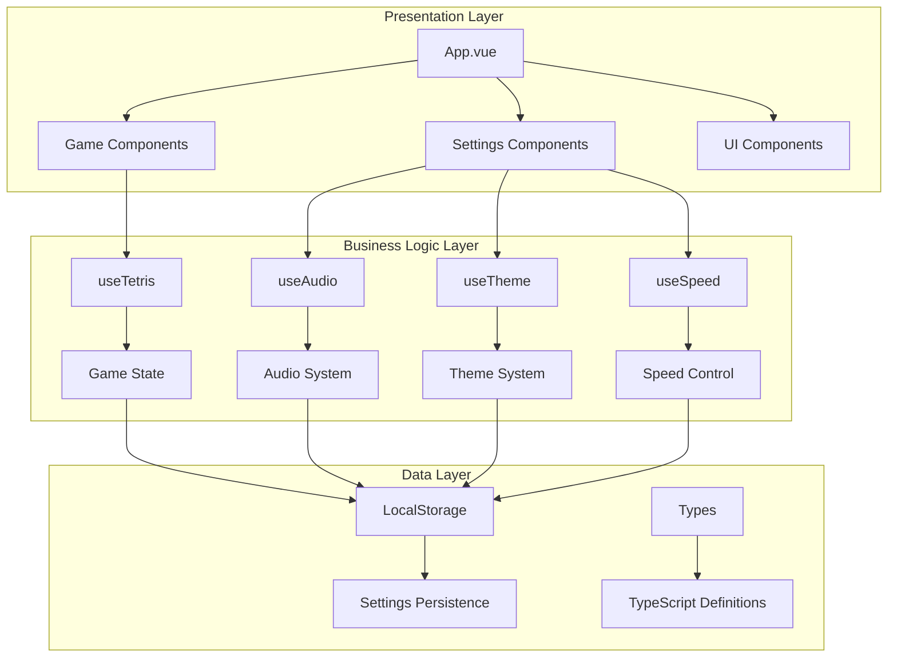

# 🏗️ Tetrys Architecture Overview

This document provides a comprehensive overview of the Tetrys architecture, design patterns, and system organization.

## 🎯 Architecture Philosophy

Tetrys follows modern web development best practices with a focus on:

- **Separation of Concerns**: Clear boundaries between UI, state, and business logic
- **Reactive Design**: Vue 3 Composition API for reactive state management
- **Type Safety**: TypeScript throughout the entire codebase
- **Performance**: Optimized rendering and efficient state updates
- **Maintainability**: Clean, documented, and testable code
- **Accessibility**: WCAG 2.1 AA compliant design

## 🏛️ System Architecture



## 📊 Layer Breakdown

### 1. Presentation Layer (Vue Components)

**Purpose**: Handle user interface, user interactions, and visual presentation

**Components**:
- `App.vue` - Root application component and layout orchestration
- `GameBoard.vue` - Renders the game grid and falling pieces
- `GameControls.vue` - Action buttons and touch/keyboard input handling
- `ScoreBoard.vue` - Displays score, level, and statistics
- `NextPiece.vue` - Shows preview of the next tetromino
- `ThemeSelector.vue` - Theme switching interface
- `AudioControls.vue` - Audio settings and volume controls
- `SpeedControl.vue` - Game speed adjustment interface

### 2. Business Logic Layer (Composables)

**Purpose**: Manage application state, business rules, and system coordination

**Composables**:
- `useTetris.ts` - Core game logic, piece movement, collision detection
- `useAudio.ts` - Audio system management, Web Audio API coordination
- `useTheme.ts` - Theme management and CSS custom properties
- `useSpeed.ts` - Game speed control and persistence

### 3. Data Layer (Types & Persistence)

**Purpose**: Define data structures and handle data persistence

**Components**:
- `types/tetris.ts` - Game state, piece definitions, and game mechanics types
- `types/theme.ts` - Theme configuration and color scheme definitions
- `localStorage` - Browser storage for settings persistence

## 🔄 Data Flow Architecture

### Reactive State Management

```typescript
// Composable Pattern
export function useGameFeature() {
  // 1. Reactive State
  const state = ref(initialState)
  
  // 2. Computed Properties
  const derivedState = computed(() => transform(state.value))
  
  // 3. Actions/Methods
  const actions = {
    updateState: (newValue) => { state.value = newValue },
    complexAction: async () => { /* business logic */ }
  }
  
  // 4. Lifecycle Management
  onMounted(() => { /* initialization */ })
  onUnmounted(() => { /* cleanup */ })
  
  // 5. Public API
  return { state, derivedState, ...actions }
}
```

### Component-Composable Integration

```vue
<script setup lang="ts">
// Import composables
const { gameState, movePiece, pauseGame } = useTetris()
const { playSound } = useAudio()

// Reactive data flows automatically through template
// Actions trigger state updates and re-renders
const handleUserAction = () => {
  movePiece(1, 0)
  playSound('move')
}
</script>
```

## 🎮 Game Architecture Deep Dive

### Game State Management

The game state follows a centralized pattern with reactive updates:

```typescript
interface GameState {
  // Board representation
  board: (TetrominoType | null)[][]
  
  // Active piece state
  currentPiece: TetrominoShape | null
  currentPosition: Position
  nextPiece: TetrominoShape | null
  
  // Game progression
  score: number
  level: number
  lines: number
  
  // Game control
  isGameOver: boolean
  isPaused: boolean
  isPlaying: boolean
  speedMultiplier: number
}
```

### Game Loop Architecture

```typescript
const gameLoop = (timestamp: number) => {
  // 1. Time-based updates
  if (timestamp - lastTime >= fallSpeed.value) {
    // 2. Physics simulation
    if (!movePiece(0, 1)) {
      // 3. Collision handling
      placePiece()
      clearLines()
      spawnNewPiece()
    }
    lastTime = timestamp
  }
  
  // 4. Continue loop
  if (gameState.isPlaying) {
    requestAnimationFrame(gameLoop)
  }
}
```

## 🎵 Audio System Architecture

### Web Audio API Integration

```typescript
// Audio Context Management
const audioContext = new AudioContext()
const musicGainNode = audioContext.createGain()
const soundGainNode = audioContext.createGain()

// Procedural Sound Generation
const createBeep = (frequency: number, duration: number) => {
  const oscillator = audioContext.createOscillator()
  const envelope = audioContext.createGain()
  
  // Configure and connect audio nodes
  oscillator.type = 'square'
  oscillator.frequency.setValueAtTime(frequency, audioContext.currentTime)
  oscillator.connect(envelope)
  envelope.connect(soundGainNode)
}
```

### Audio State Management

```typescript
const audioSystem = {
  // Context Management
  initAudioContext: () => Promise<boolean>
  ensureAudioContextRunning: () => Promise<boolean>
  
  // Music System
  startMusic: () => void
  pauseMusic: () => void
  resumeMusic: () => void
  
  // Sound Effects
  playSound: (type: SoundType) => Promise<void>
  
  // Settings
  toggleMusic: () => Promise<void>
  setVolume: (type: 'music' | 'sound', volume: number) => void
}
```

## 🎨 Theme System Architecture

### CSS Custom Properties Strategy

```css
:root {
  /* Theme variables */
  --theme-bg: #000000;
  --theme-primary: #00ff00;
  --theme-surface: #111111;
  
  /* Piece colors */
  --piece-i: #00ffff;
  --piece-o: #ffff00;
  --piece-t: #ff00ff;
}
```

### Dynamic Theme Application

```typescript
const applyThemeToDocument = (theme: Theme) => {
  const root = document.documentElement
  
  // Apply color scheme
  Object.entries(theme.colors).forEach(([key, value]) => {
    root.style.setProperty(`--theme-${kebabCase(key)}`, value)
  })
  
  // Apply piece colors
  Object.entries(theme.pieces).forEach(([piece, color]) => {
    root.style.setProperty(`--piece-${piece.toLowerCase()}`, color)
  })
}
```

## 📱 Responsive Design Architecture

### Mobile-First CSS Strategy

```css
/* Base: Mobile styles (375px+) */
.game-container {
  flex-direction: column;
  padding: 10px;
}

/* Tablet: Enhanced layout (768px+) */
@media (min-width: 768px) {
  .game-container {
    flex-direction: row;
    padding: 20px;
  }
}

/* Desktop: Full features (1024px+) */
@media (min-width: 1024px) {
  .game-container {
    max-width: 1200px;
    margin: 0 auto;
  }
}
```

### Touch Input Architecture

```typescript
const touchHandler = {
  // Gesture Recognition
  swipeDetection: (startTouch, endTouch) => SwipeDirection
  tapDetection: (touchDuration) => boolean
  longPressDetection: (touchDuration) => boolean
  
  // Game Actions
  handleSwipeLeft: () => movePiece(-1, 0)
  handleSwipeRight: () => movePiece(1, 0)
  handleSwipeDown: () => movePiece(0, 1)
  handleTap: () => rotatePiece()
  handleLongPress: () => dropPiece()
}
```

## 🧪 Testing Architecture

### Test Strategy Layers

```typescript
// Unit Tests: Individual functions and composables
describe('useTetris', () => {
  it('should move piece correctly', () => {
    const { movePiece, gameState } = useTetris()
    // Test individual function behavior
  })
})

// Component Tests: UI behavior and user interactions
describe('GameBoard', () => {
  it('should render game board correctly', () => {
    const wrapper = mount(GameBoard, { props: { gameState } })
    // Test component rendering and interactions
  })
})

// Integration Tests: System behavior across multiple components
describe('Game Integration', () => {
  it('should handle complete game cycle', () => {
    // Test full game workflows
  })
})
```

## 🚀 Performance Architecture

### Optimization Strategies

1. **Reactive Efficiency**: Minimal re-renders through computed properties
2. **Memory Management**: Proper cleanup in onUnmounted hooks
3. **Bundle Optimization**: Vite's tree-shaking and code splitting
4. **Image Optimization**: Responsive images and lazy loading
5. **Audio Optimization**: Efficient Web Audio API usage

### Performance Monitoring

```typescript
// Game Loop Performance
const performanceMonitor = {
  frameTime: 0,
  averageFrameTime: 0,
  
  measureFrame: (callback: () => void) => {
    const start = performance.now()
    callback()
    const end = performance.now()
    
    this.frameTime = end - start
    this.updateAverage()
  }
}
```

## 🔧 Build Architecture

### Vite Configuration Strategy

```typescript
// vite.config.ts
export default defineConfig({
  // Development optimizations
  server: { 
    open: true,
    cors: true 
  },
  
  // Build optimizations
  build: {
    target: 'es2020',
    rollupOptions: {
      output: {
        manualChunks: {
          vendor: ['vue'],
          audio: ['./src/composables/useAudio.ts']
        }
      }
    }
  },
  
  // Plugin configuration
  plugins: [vue(), /* other plugins */]
})
```

## 🌍 Deployment Architecture

### Static Site Generation Strategy

```yaml
# netlify.toml
[build]
  publish = "dist"
  command = "npm run build"

[[redirects]]
  from = "/*"
  to = "/index.html"
  status = 200

# Performance headers
[[headers]]
  for = "/assets/*"
  [headers.values]
    Cache-Control = "public, max-age=31536000, immutable"
```

## 📈 Scalability Considerations

### Future Architecture Enhancements

1. **State Management**: Consider Pinia for complex state scenarios
2. **Component Library**: Extract reusable components for other games
3. **Plugin System**: Modular architecture for game extensions
4. **WebRTC Integration**: Multiplayer game architecture
5. **Service Worker**: Offline-first PWA capabilities

### Performance Scaling

- **Code Splitting**: Dynamic imports for non-critical features
- **Image Optimization**: WebP format with fallbacks
- **CDN Integration**: Static asset delivery optimization
- **Caching Strategy**: Service worker for offline functionality

## 🔗 Architecture Patterns

### Design Patterns Used

1. **Composition Pattern**: Vue 3 Composition API
2. **Observer Pattern**: Reactive state management
3. **Strategy Pattern**: Theme and audio system flexibility
4. **Module Pattern**: Clear separation of concerns
5. **Factory Pattern**: Tetromino piece generation

### SOLID Principles Application

- **Single Responsibility**: Each composable has one clear purpose
- **Open/Closed**: Theme system extensible without modification
- **Liskov Substitution**: Component props follow interface contracts
- **Interface Segregation**: Composables expose only necessary methods
- **Dependency Inversion**: Components depend on abstractions, not concretions

---

This architecture provides a solid foundation for a maintainable, performant, and scalable modern web game. The reactive nature of Vue 3 combined with TypeScript ensures type safety and excellent developer experience.